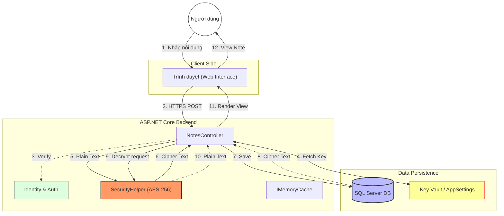

```mermaid
graph TD
    %% Định nghĩa các thực thể
    User((Người dùng))

    subgraph Client_Side ["Client Side"]
        Browser["Trình duyệt (Web Interface)"]
    end

    subgraph Server_Side ["ASP.NET Core Backend"]
        direction TB
        Controller["NotesController"]
        Auth["Identity & Auth"]
        Security["SecurityHelper (AES-256)"]
        Cache["IMemoryCache"]
    end

    subgraph Storage ["Data Persistence"]
        DB[("SQL Server DB")]
        KeyStore["Key Vault / AppSettings"]
    end

    %% Luồng ghi dữ liệu (Write Flow)
    User -->|1. Nhập nội dung| Browser
    Browser -->|2. HTTPS POST| Controller
    Controller -.->|3. Verify| Auth
    Controller <-->|4. Fetch Key| KeyStore
    Controller -->|5. Plain Text| Security
    Security -->|6. Cipher Text| Controller
    Controller -->|7. Save| DB

    %% Luồng đọc dữ liệu (Read Flow)
    DB -.->|8. Cipher Text| Controller
    Controller -->|9. Decrypt request| Security
    Security -.->|10. Plain Text| Controller
    Controller -->|11. Render View| Browser
    Browser -->|12. View Note| User

    %% Styling
    style User fill:#fff,stroke:#333
    style Security fill:#f96,stroke:#333,stroke-width:2px
    style DB fill:#bbf,stroke:#333,stroke-width:2px
    style KeyStore fill:#ff9,stroke:#f66,stroke-width:2px
    style Auth fill:#dfd,stroke:#333
```
